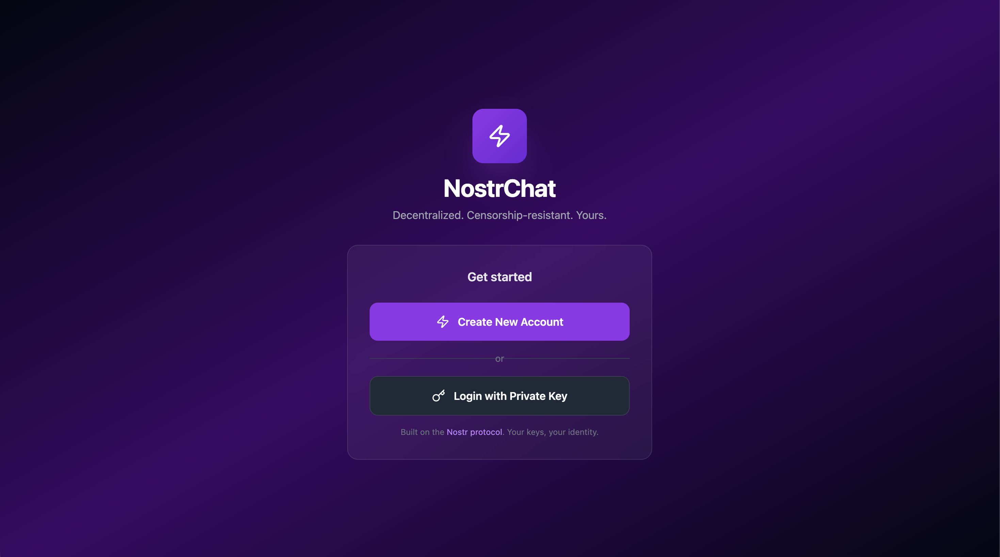

# nostr-chat

A privacy-first chat app built on the Nostr protocol — DMs, encrypted groups, channels, and WebRTC calls.



## Features

### Messaging

- End-to-end encrypted DMs (NIP-04)
- Public and private channels
- Encrypted group chats with AES-256-GCM — group keys distributed via NIP-04 DMs
- Reply/quote messages, draft persistence, unread message divider
- Message send status (pending / delivered / failed with retry)

### Calls

- WebRTC audio/video calls directly between users
- TURN server configuration with cross-device sync (NIP-78)
- TURN credentials shared in the encrypted call offer — no extra setup for the callee

### Files & Media

- File attachments up to 50 MB (chunked transfer over Nostr events)
- Shared media gallery with full-screen lightbox per conversation
- Image, video, voice message, and generic file support

### Cross-device & Sync

- All data stored in per-user IndexedDB — no account, no server required
- Contacts, channels, and settings sync via your own Nostr relays (NIP-02, NIP-51, NIP-78)
- Live relay connection health monitor in Settings

### UX

- Progressive Web App — installable on mobile and desktop
- Mobile-first responsive layout with bottom nav and slide-up sheets
- Scoped search in Messages and Channels panels
- Profile cards with NIP-05 identifier display

## Tech Stack

React 19 · TypeScript · Vite · Tailwind CSS · Zustand · Dexie.js · nostr-tools · Vitest

## Getting Started

### Prerequisites

- Node.js 20+
- A Nostr private key in hex or `nsec` format — generate one at [nsec.app](https://nsec.app) or any Nostr client

### Install & run

```bash
git clone https://github.com/your-username/nostr-chat.git
cd nostr-chat
npm install
npm run dev
```

### Build

```bash
npm run build
```

### Test

```bash
npm test
```